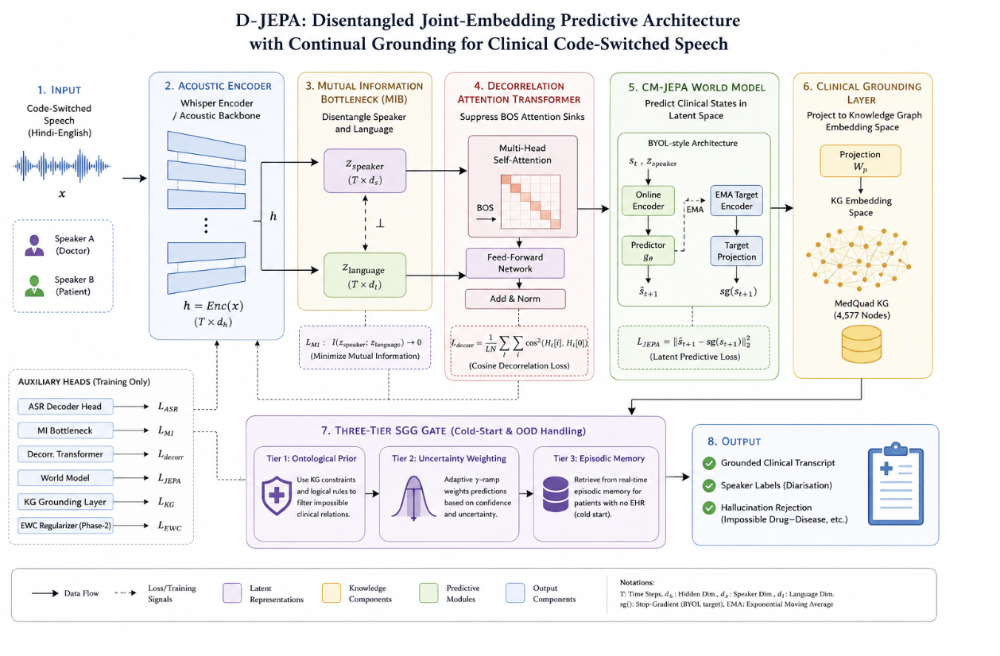

# D-JEPA: Disentangled Joint-Embedding Predictive Architecture with Continual Grounding

---

## Quick Start

D-JEPA is a speech model for Hinglish (Hindi-English code-switching) that disentangles speaker identity from language content, anchors representations to a medical knowledge graph, and adapts to new speakers without forgetting old ones.

```bash
# Install
uv venv --python 3.13
uv pip install -r requirements.txt

# Build dataset (streams from HuggingFace, ~15s)
uv run python dataset/build_dataset.py

# Train
uv run python -m model.train

# Run tests (inference on held-out test set)
uv run python -m tests.test_diarization_mer
uv run python -m tests.test_attention_sinks
uv run python -m tests.test_clinical_grounding
uv run python -m tests.test_cold_start

# Fine-tune LoRA baselines
uv run python -m baselines.train_whisper_lora
```

## Architecture



## Contributors

| Name | Roll Number | Subgroup |
|------|-------------|----------|
| Kanav Dhanda | 102303168 | 3C16 |
| Krrish Punj | 102303172 | 3C16 |
